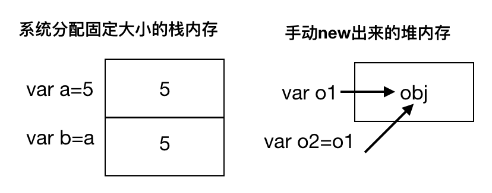
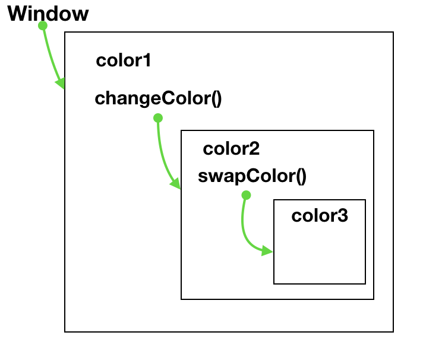

# 基础概念
------
#### 1.变量
* js中的变量跟其他语言不同，它是松散类型的，就是说在代码执行的生命周期内，变量的类型是可以改变的。
* 变量只是用于保存特定值的一个名字而已。
* 变量保存的 *值* 分为：`基本类型`和`引用类型`
    * `基本类型`有：`Undefined`， `Null`， `Boolean`， `Number`， `String` 和 `Symbol`
    * `引用类型`有：`Object`， `Array`， `Date`， `RegExp`， `Function`，`Set` 和 `Map`
* 变量的值是基本类型时，复制到另一个变量时，是由系统新分配一块栈内存，将值拷贝进去。
* 变量的值是引用类型时，复制到另一个变量时，是将指针指向同一个对象。


#### 2.作用域
* 执行上下文(execution context)也叫执行环境，一个执行环境定义了变量或函数有权访问的其他数据。
* 每个执行环境都有一个与之关联的 *对象* 叫做：**变量对象（VO）**，VO中保存了这个执行环境中定义的所有变量和函数，当作用域链的最前端，也就是当前其执行的代码所在环境的变量对象是函数时，则将其 **活动对象（AO）**当作变量对象。
* 当代码在一个环境中执行时，会创建VO的一个作用域链，它保证了执行环境访问变量和函数的有序性。
```javascript
    var color1 = "red";
    function changeColor(){
        var color2 = "yellow";
        function swapColor(){
            var color3 = color2;
            color2 = color1;
            color1 = color3;
        }
        swapColor();
    }
    changeColor();
```
上面的代码涉及3个执行环境：全局执行环境、changeColor()的局部执行环境、swapColor()的局部执行环境
全局执行环境的VO={color1:"red",changeColor:changeColor}
changeColor()局部执行环境的VO={color2:"yellow",swapColor:swapColor}，但它还能访问全局执行环境的color1
swapColor()局部执行环境的VO={color3:""}，但它还能访问全局执行环境的color1和changeColor的color2和swapColor，因为它们时它的父执行环境。



* 当某个执行环境的所有代码执行完成后，这个环境会被销毁，其中的变量和函数也会销毁。
* 作用域链的最前端始终是当前执行环境的变量对象，而最后一个变量对象始终是全局执行环境。
* 注意：函数的参数也是当作局部变量来对待
* 注意：AO最开始时只包含一个arguments对象。
* 标志符解析是沿着作用域链一级一级的搜索，从作用域链的前端开始向后搜索，若找不到就报错。
* 内部环境可以通过作用域链访问外部环境，但外部环境不可以访问内部环境的变量和函数。

#### 3.内存问题
* js具有自动垃圾回收机制，常用回收方式是：标记清除 和 引用计数。
* 引用计数会有一个循环引用的问题，为了消除这个问题，最好在变量不再使用时，手动断开连接，解除引用。
var a = null ——> a脱离执行环境——>到点回收器会进行回收（垃圾回收器时定时回收的）。

#### 4.闭包
* 闭包是函数，怎样的函数？ 拥有权利访问另一个函数作用域中的变量的函数。
* 创建闭包的方式： 一个函数包含另一个函数
```javascript
function test(arg1){
    return function(){
        console.log(arg1); //这个匿名函数就用权力访问test中的arg1
    }
}

test(1)();// 1
```
上面的匿名函数访问了test函数的arg1变量，即是这个内部函数被返回了，而且在其他地方调用。为什么可以访问arg1呢，因为匿名函数的作用域链包含了test的执行环境。

[返回顶端](#基础概念) [返回目录](../README.md)
