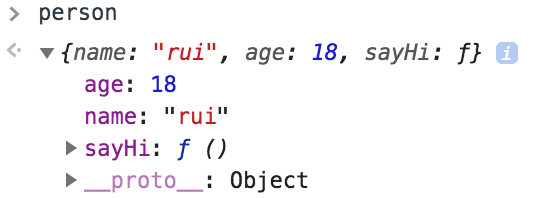
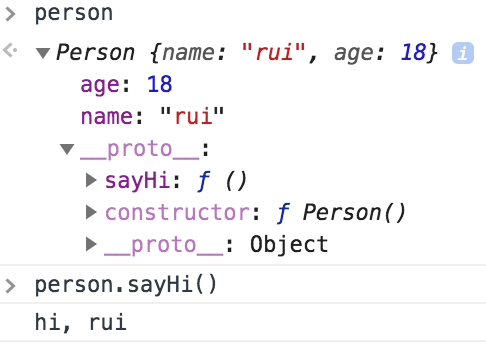
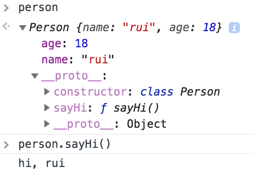
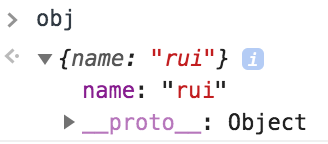
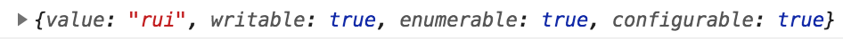
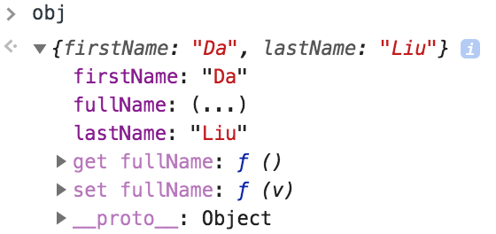
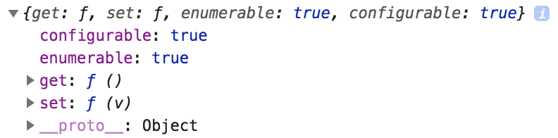

# 对象
------
js中的对象就是一组无序的 *“属性-值”* 集合。值可以是数据或者函数。ES6中增加了类 *class*，在ES6之前，js通过定义对象来处理面向对象编程。

### 创建对象的基本方法
* 使用new Object()
* 使用对象字面量方法
* 自定义一个对象，通过new + 构造函数

##### 一、new Object()
```javascript
const person = new Object();
    person.name = "rui";
    person.age = 18;
    person.sayHi = function () {
        console.log("hi," + this.name);
    }
```
###### 输出结果：


##### 二、对象字面量方法
字面量是最常用的方法
```javascript
const person = {
    name:"rui",
    age:18,
    sayHi:function(){
        console.log("hi, " + this.name);
    }
};
```
###### 输出结果：同上

##### 三、也可用`Object.create(Object.prototype)` 来创建
相当于将Object的原型对象上的属性和方法复制给新的对象，第一个参数即是指定新对象的`__proto__`，第二个参数是一组属性，至于[属性](###属性)的详细讨论，请看后面介绍。
```javascript
const person = Object.create(Object.prototype,{
    name:{
        value:"rui",
        enumerable:true
    },
    age:{
        value:18,
        enumerable:true
    },
    sayHi:{
        value:function(){
            console.log("hi, " + this.name);
        },
        enumerable:true
    }
});
```
##### 四、自定义一个对象类型，再通过调用构造函数创建。
```javascript
function Person(){
    this.name = "rui";
    this.age = 18;
}
Person.prototype.sayHi = function(){
    console.log("hi, " + this.name);
}
let person = new Person();
```
###### 输出结果：


可以用ES6新增的Class替代
```javascript
class Person {
    constructor(){
        this.name =  "rui";
        this.age = 18;
    }
    sayHi(){ 
        console.log("hi, " + this.name);
    }
}
let person = new Person();
```
###### 输出结果：


### 属性
对象的属性分为两类，`数据属性`和 `访问器属性`。

`数据属性`有4个特征

| 特性 | 描述  | 备注 |
| ----|----| ----|
|`[[Configurable]]` | 指属性是否可配置/操作 | 默认值为true，设置为false后，不能用`delete`删除该属性 |
| `[[Enumerable]]`  | 是否可枚举| 默认值为true，设置为false后，无法通过`for-in`遍历出来 |
| `[[Writable]]` | 是否可写    | 默认值为true |
|  `[[Value]]` | 属性的值        | |

`访问器属性`也有4个特征

| 特性 | 描述  | 备注 |
| ----|----| ----|
|`[[Configurable]]` | 指属性是否可配置/操作 | 默认值为true，设置为false后，不能用`delete`删除该属性 |
| `[[Enumerable]]`  | 是否可枚举| 默认值为true，设置为false后，无法通过`for-in`遍历出来 |
| `[[Get]]` | 返回属性值的方法    | 是函数 |
|  `[[Set]]` | 返回设置属性值的方法 | 是函数 |

定义|修改 以及 获取这些属性特性描述 的方法：

***例如：在obj上定义一个name数据属性***
```javascript
var obj = {};
Object.defineProperty(obj,"name",{
    configurable: true,
    enumerable: true,
    writable: true,
    value: "rui"
});
console.log(obj.name);
```
###### 输出结果：


***获取name属性的特性描述***

```javascript
var des = Object.getOwnPropertyDescriptor(obj,"name");
console.log(des);
```
###### 输出结果：


***例如：在obj上定义一个fullName访问器属性***
```javascript
var obj = {firstName:"Rui",lastName:"Lee"};
Object.defineProperty(obj,"fullName",{
    configurable: true,
    enumerable: true,
    get: function(){return `${this.lastName} ${this.firstName}`; },
    set: function(v){this.lastName = v.split(" ")[0];this.firstName = v.split(" ")[1]}
});
obj.fullName = "Liu Da"
console.log(obj.fullName);
```
###### 输出结果：


***获取fullName属性的特性描述***
```javascript
var des = Object.getOwnPropertyDescriptor(obj,"fullName");
console.log(des);
```
###### 输出结果：


##### 使用字面量定义访问器属性 和 在类中定义访问器属性

```javascript
var obj = {
    firstName:"Rui",
    lastName:"Lee",
    get fullName(){
        return `${this.lastName} ${this.firstName}`;
    },
    set fullName(v){
        this.lastName = v.split(" ")[0];
        this.firstName = v.split(" ")[1];
    }
};
console.log(obj.fullName);//Lee Rui

class Obj {
    constructor(){
        this.firstName = "Rui";
        this.lastName = "Lee";
    }
    get fullName(){
        return `${this.lastName} ${this.firstName}`;
    }
    set fullName(v){
        this.lastName = v.split(" ")[0];
        this.firstName = v.split(" ")[1];
    }
}
var oo = new Obj();
console.log(oo.fullName);//Lee Rui
```


[返回顶端](#对象) [返回目录](../README.md)