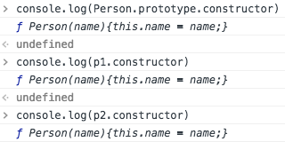
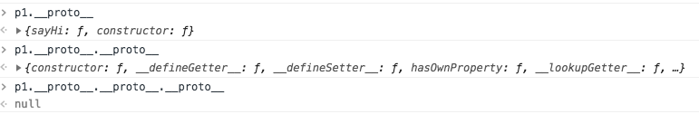

# 原型与原型链
------
js中“十大令人疑惑的概念排行榜”中“原型”与“原型链”绝对是值得讨论和学习的。

### 一、Prototype（原型）

#### 原型（prototype）与原型对象（Person.prototype）
>原型是存在于函数中的一个属性，它指向 **原型对象**

根据定义，我们就创建一个“构造函数”，把prototype属性打印出来看看到底是什么：
```javascript
function Person(name){
    this.name = name;
}
console.log(Person.prototype);
```


从打印结果看出，它指向的是一个 *“对象”*，这个对象有一个`constructor`，还有一个`__proto__`，`constructor`的值就是我们刚刚定义的Person函数，`__proto__`又是什么？值为什么是Object?
别急，我们刚刚创建了一个Person构造函数，我们再为其定义一个公用方法`sayHi`，并new一个Person实例p。

```javascript
function Person(name){
    this.name = name;
}
Person.prototype.sayHi = function(){
    console.log(`Hi, ${this.name}`);
}
let p = new Person("rui");
console.log(p.sayHi());//Hi，rui
```


我们再看看此时实例对象p和Person原型对象的关系：


根据上图发现p的`__proto__`属性与`Person.prototype`是相同的，它们都指向Person的原型对象。
而且，我们发现sayHi方法被添加到了这个 *原型对象*上。若再创建一个p2实例`p2 = new Person("xin")`，`p2.sayHi();//Hi, xin` 也会正常执行。所以可以得出下面的关系图：


`Person`有一个`prototype`，指向原型对象，原型对象有一个`constructor`，反回来指向`Person`本身也就是构造函数，另外，原型对象还有一个之前创建的`sayHi()`。两个实例`p`和`p2`都有属性`name`，以及`__proto__`，`__proto__`也指向原型对象，所以实例对象p与原型对象的关系就是：对象会从它的原型对象上继承方法和属性。

我们来验证一下：
```javascript
console.log(Person.prototype === p1.__proto__);//true
console.log(Person.prototype === p2.__proto__);//true
console.log(p1.__proto__ === p2.__proto__);//true
console.log(Person.prototype.constructor);
console.log(p1.constructor === p2.constructor);
```




*注意：* 为什么p1和p2的`constructor`是函数Person呢，因为从自身查找`constructor`属性不存在，就会向上级查找，上级就是 `p1.__proto__` 也就是 `Person.prototype`，在这里，我们找到了`constructor`，它是反指回Person构造函数本身的，所以p1和p2的`constructor`是Person 。再回到之前看到的`Person.prototype`对象中也有一个`__proto__`属性，它指向的是`Object.prototype`，因为在js中，几乎所有的对象都可以看作是`Object`的实例，所有的对象都继承自`Object.prototype`，那`Object.prototype`的原型对象又是什么呢？从下图发现，是null，null就表示“不存在”，“没有”，说明它是最顶级，已经到头了。那么这个`p1.__proto__.__proto__.__proto__`就是所谓的 *原型链*。




### 二、原型链
原型链就是指一个对象的继承“路径”，通过原型链可以了解js中的继承原理。
下面介绍一下继承方式：

#### 1.继承
```javascript
function Father(name){//父亲的构造函数
    this.name = name;
}
Father.prototype.sayHi = function(){console.log("Hi,"+this.name)}//自定义的原型方法sayHi

function Son(name,age){//儿子的构造函数
    Father.call(this,name);//需要执行一次父亲的构造函数，以继承name属性
    this.age = age;//儿子的新属性
}

Son.prototype = Object.create(Father.prototype);//Object.create()函数作用是创建一个新对象，使用现有对象来创建新对象的__proto__。儿子继承了父亲原型对象上的属性和方法。
Son.prototype.constructor = Son;//因为继承下来的constructor是指向Father,所以这里需要改为指向Son（根据原型对象的定义）
Son.prototype.sayAge = function(){console.log("You are "+this.age)}//新增的儿子原型方法sayAge

function Grandson(name,age,hobbies){//孙子的构造函数
    Son.call(this,name,age);//执行一次Son构造函数
    this.hobbies = hobbies;//孙子的新属性
}

Grandson.prototype = Object.create(Son.prototype);//孙子继承儿子的原型对象
Grandson.prototype.constructor = Grandson;//修改constructor的指向
Grandson.prototype.sayHobbies = function(){console.log("You like "+this.hobbies)}//新增的孙子原型方法sayHobbies

let son = new Son("son",40);
console.log(son);

let grandson = new Grandson("grandson",17,"sing");
console.log(grandson);
```


上面的方法里用到了`Object.crate()`，如果换成`new Father()` 有什么区别呢？

#### 2.用new来继承如何？

```javascript
function SuperClass(){
    this.name = "super";
}
SuperClass.prototype.message = function(){console.log("hello message")}

function SubClass(){
    SuperClass.call(this);
}

SubClass.prototype = new SuperClass();//直接通过new一个superclass的实例对象给子类的原型
SubClass.prototype.constructor = SubClass;

let sub = new SubClass();
console.log(sub);
```


从结果打印来看，似乎没什么区别，其实`new SuperClass()`会执行一次父类构造函数，就是`SuperClass()`，但是我们在`SubClass`里已经执行了`SuperClass.call(this);`，所以会执行2次构造函数。而`Object.crate(o)`相当于：

```javascript
function objectCreate(o) {
    function F() {}//新创建一个构造函数
    F.prototype = o;把传进来的对象作为原型对象赋给F的prototype
    return new F();//重新new一个干净的实例。
}
```
它没有使用父类构造函数，所以应该用它来继承父类原型对象的属性和方法。

#### 3.在看一眼关系图


图中红色的“路径”就是“原型链”～

[返回顶端](#原型与原型链) [返回目录](../README.md)
