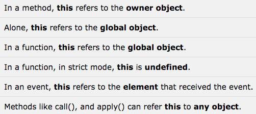
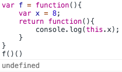
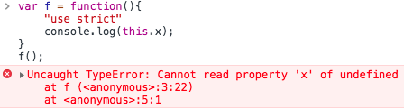
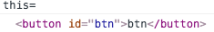
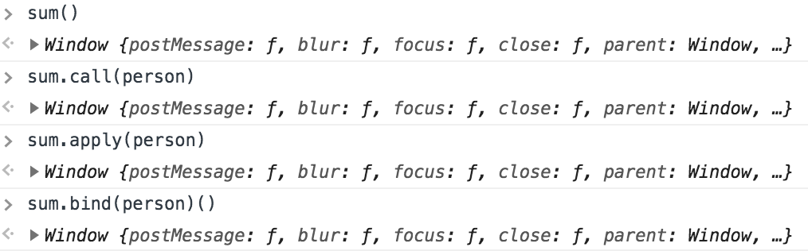
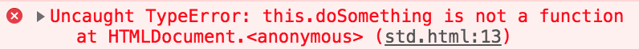
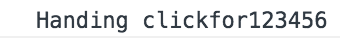

# This
------
js中的this关键字其实令人困惑，但日常开发学习中，记住下面的内容，就可以啦。
在其他语言中，*this* 是对类实例化的当前对象的引用，在js中，*this* 通常指“拥有”该方法的对象，但它还取决于函数的调用方式。

#### 一、几种常见情况



* 如果是调用一个对象的构造函数或者方法，则this是指向对象实例，这种情况和大多数其他语言一样了
* 如果没有当前对象，this 指全局对象（在web浏览器中，this为Window）
* 如果是单纯的调用一个函数，此时函数内部的this 仍然是全局对象
* 如果是单纯的调用一个函数，严格模式下this 是undefined
* 在事件中，this指向接收事件的元素
* 注意，当使用`call()` `apply()` `bind()`函数时，可将this 指到任意的对象上去
* 注意，箭头函数是没有this 的，在箭头函数内部的this会指向其最近一层非箭头函数的owner，且箭头函数使用`call()` `apply()` `bind()`方法不会改变this的指向，会被直接忽略。

#### 二、例子说明

##### 1、调用对象的方法
```javascript
var x = 1;
var obj = {
    x:2,
    f:function(){
        console.log(this.x);
    }
}
obj.f();//2
```
因为f函数在obj内部，此时this是指向obj的，所以this.x === obj.x

##### 2、没有对象
```javascript
var x = 1;
var f = function(){
    console.log(this.x);
}
f();//1

var f = function(){
    return function(){
        console.log(this.x);
    }
}
f()();//1
```
此时this是全局对象window，在window中找到变量x，所以值是1。若在全局中没有找到x，则会返回undefined，思考下图：


##### 3、严格模式下
```javascript
var f = function(){
    "use strict"
    console.log(this.x);
}
f();//js报错
```


##### 4、事件上的this
```html
<!DOCTYPE html>
<html>
<head>
    <meta charset="utf-8">
    <title></title>
</head>
<body>
    <button id="btn">btn</button>
    <script> 
        var btn = document.getElementById('btn');
        btn.onclick = function(){ 
                console.log("this=");
                console.log(this)
            }
    </script>
</body>
</html>
```
接收点击事件的元素是button，故this是指button



##### 5、call() apply() bind() 改变this指向

```javascript
function showMessage(message) {
    console.log(`${this.name} ${message}`);
}
const obj = {name: "rui"};

showMessage("welcome");//  welcome 

showMessage.call(obj, "welcome");//rui welcome
showMessage.apply(obj,["welcome"]);//rui welcome
showMessage.bind(obj,"welcome")();//rui welcome

```
showMessage函数通过call/apply/bind函数的方式调用，把this指向传入的obj，所以this.name 等价于obj.name，函数执行结果如上。

##### 6、箭头函数里的this
在讨论this之前，我们先看看什么是箭头函数。
>箭头函数的设计目标是用来代替匿名函数表达式，它的语法更简洁，具有词法级的this绑定，没有arguments对象，函数内部的this值不可被改变，因而不能作为构造函数使用。

那么如何定义箭头函数？

* `let reflect = value => value;` 只有一个参数，返回值是一个表达式
* `let sum = (num1,num2) => num1+num2;` 多个参数需要小括号
* `let getName = () =>"Rui";` 没有参数时也需要小括号
* `let multi = (n1,n2) => {console.log(n1,n2);return n1*n2;}` 函数体不是简单表达式时需要大括号
* `let getItem = id => ({id:id,name:"temp"});` 当返回值是一个对象字面量时，需要小括号
* `let person = ((name) => {return name;})("Rui")` 这是箭头函数的立即执行表达式(()=>{})(参数)

那么箭头函数与普通函数的区别是？

* 没有this、super、 arguments和 new.target绑定，在箭头函数中的这些值由外围最近一层非箭头函数决定
* 不能通过new关键字调用，因为箭头函数没有[[Construct]]方法，所以不能当成构造函数
* 没有原型，不存在prototype这个属性

例子：
```javascript
var x = 1;
var obj = {
    x:2,
    f:function(){
        x = 3;
        return () => this.x;
    }
}
obj.f()();//2
console.log(x);//3
```
箭头函数内的this值由外围最近一层非箭头函数，即是函数f决定。obj.f()由obj调用，故f函数的this是obj,obj.x = 2所以执行结果为2。f函数的x=3;语句是修改了全局变量x，而不是obj的x。

例子：

```javascript
var obj = {x:2}
let sum = () => this;
sum();//this === window
sum.call(obj);// this === window
sum.apply(obj);// this === window
sum.bind(obj);// this === window
```
sum函数是箭头函数，它没有被函数包围，所以是指向全局的，即是window，箭头函数被call,apply,bind调用，会直接忽略传进来的this参数，this是不会改变的。



例子：

```html
<!DOCTYPE html>
<html>
<head>
    <title></title>
</head>
<body>
<button id="btn">btn</button>
<script>
    let PageHandler = {
    id: "123456",
    init:function(){
        document.addEventListener("click",function(event){
            this.doSomething(event.type);
        },false);
    },
    doSomething:function(type){
        console.log("Handing "+type+"for "+this.id);
    }
};
PageHander.init();
</script>
</body>
</html>
```
上述代码`document.addEventListener`中的this是指向document而不是PageHandler,所以this.doSomething会报错，找不到这个方法。使用传统的方式，用bind可以解决，用箭头函数更便捷。



```javascript
//传统方法
document.addEventListener("click",(function(event){
            this.doSomething(event.type);
        }).bind(this),false);
//箭头函数方法
document.addEventListener("click",(event) => {
            this.doSomething(event.type);
        },false);
```


[返回顶端](#This)