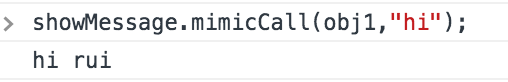
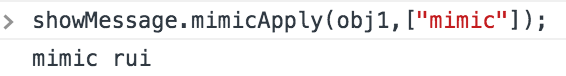
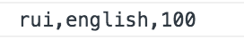

# 轮子们
------
今天来学习一下模拟实现下面几个函数：增加对基础知识的理解。在此要先谢谢网络上各位大神的文章，有时候书中难以得到直白的“答案”，别人的讲解会让你瞬间明白。

* new Constructor()
* call()
* apply()
* bind()

### mimic new 运算
自定义一个对象，通常做2件事：
1. 通过写一个函数定义一个对象类型；
2. 用new来创建一个实例。

例子：
```javascript
function Car(name, price){
    this.name = name;
    this.price = price;
}
let car = new Car("toyota",30);
console.log(car);
```


根据MDN上的解释，`new Car(...)`执行时，做了下面几件事：

1. 一个新对象被创建，并继承Car.prototype;
2. 执行了构造函数Car()一次，当然需要将this值绑定到新的对象。

另外：要是构造函数返回一个函数或者对象，则会覆盖正在创建的这个新对象，其他情况下会返回新对象。

```javascript
function mimicNew() {
    var obj = Object.create(Object.prototype);//创建一个对象
    var constructorFunc = [].shift.call(arguments);//返回传入的第一个参数，即是构造函数Car
    obj.__proto__ = constructorFunc.prototype;//将obj的__proto__指向Car的原型对象，即是继承
    var res = constructorFunc.apply(obj,arguments);//此时的arguments已经去掉了构造函数，剩余的参数可以直接传入Car()
    return res instanceof Object ? res : obj;
}
let car2 = mimicNew(Car,"toyota",30);
console.log(car2);
```


### mimic call()函数
函数如果通过call的方式调用，可以把this指向任意对象。
先看下面的例子：
```javascript
function showMessage(message) {
 console.log(message, this.name);
}
const obj1 = {name: "rui"};
const obj2 = {name: "xin"};
showMessage.call(obj1, "welcome ");//welcome rui
showMessage.call(obj2, "welcome ");//welcome xin
```
上面的call函数的效果等同于把showMessage函数添加到obj1中，再调用这个函数。
```javascript
let fn = Symbol("symbol");//创建一个Symbol()，作为showMessage在obj1中的属性名，这样可使其唯一。
const obj1 = {
    name:"rui",
    [fn]:function(message){console.log(message, this.name);}//showMessage
}
obj1[fn]("welcome");//welcome rui
```
有了上面代码的思路，我们就可以模拟call函数做的事了：
1. 给传进来的obj添加一个属性，属性值就是调用mimicCall()的那个函数； 
2. 执行这个新添加进来的函数，执行这函数时，若调用函数有带参数，则需要传进这个函数；
3. 最后再删除它。

```javascript
Function.prototype.mimicCall = function(someOtherThis) {
    someOtherThis = someOtherThis || window;//若传进来的第一个参数是null，则this指向全局
    let fnName = Symbol("symbol2");
    someOtherThis[fnName] = this;//因为showMessage函数也是对象，当调用从函数原型继承下来的函数mimicCall时，mimicCall内部的this会指向调用它的showMessage，即是showMessage函数的引用。
    
    const args = [];//用个数组来存放传进来的参数，因为arguments[0]是someOtherThis，所以参数从arguments[1]开始算。
      for (var i = 1, len = arguments.length; i < len; i++) {
        args.push("arguments[" + i + "]");
      }//args里存的是参数字符串,类似：["arguments[1]","arguments[2]","arguments[3]"]
    var jsStr = "someOtherThis[fnName](" + args + ")";//将数组和字符串平接，数组会自动调用Array.toString()方法，把元素展开，所以jsStr是类似："someOtherThis[fnName](arguments[1],arguments[2],arguments[3])"这样的字符串。
    var result = eval(jsStr);//eval方法是执行string里的代码，就是执行了someOtherThis[fnName]方法。
    delete someOtherThis[fnName];//最后一步，删除这个属性。

    return result;//返回执行后的结果
}

showMessage.mimicCall(obj1,"hi");
```


ES6推出了`...`这个扩展运算符，它可以给函数传入不定参数。

```javascript
Function.prototype.mimicCallES6 = function(someOtherThis, ...args) {
    someOtherThis = someOtherThis || window;
    let fnName = Symbol();
    someOtherThis[fnName] = this;
    var result =  someOtherThis[fnName](...args);//不定参数传入someOtherThis[fnName]函数。
    Reflect.deleteProperty(someOtherThis, fnName);//Reflect.deleteProperty 也是ES6推出的删除对象某个属性的方法，等价于delete 操作。
    return result;
}

showMessage.mimicCallES6(obj1,"mimic");
```
### mimic apply()函数
apply于call非常相似，区别在于传入的第二个参数是数组形式，而不是离散的一个一个的参数。

```javascript
Function.prototype.mimicApply = function (someOtherThis, arr) {
    someOtherThis = someOtherThis || window;
    let fnName = Symbol();
    someOtherThis[fnName] = this;

    var args = [];
    var result = null;
    if (!arr) {
        result = someOtherThis[fnName]();
    } else {
        for (let i = 0, len = arr.length; i < len; i++) {//arr是参数数组，直接从0开始组装，原理和call一样。
          args.push("arr[" + i + "]");
        }
        result = eval("someOtherThis[fnName](" + args + ")");
    }

    delete someOtherThis[fnName];
  
    return result;
}
showMessage.mimicApply(obj1,["mimic"]);
```



### mimic bind()函数
bind函数于call,apply的区别在于bind是返回一个新函数，但是没有执行它。

```javascript
Function.prototype.mimicBind = function(someOtherThis) {

  if (typeof this !== "function") {
    throw new Error(this + "cannot be bound as it's not callable");
  }//若不是函数调用mimicBind，我们则报错。

  var boundTargetFunction = this;//绑定的目标函数
  var boundArguments = Array.prototype.slice.call(arguments, 1);//返回去掉someOtherThis后传入的参数。

  return function boundFunction() {//返回一个函数，而非执行它返回执行结果，区别于call与apply。

    var targetArguments = Array.prototype.slice.call(arguments);//这里的参数是第二次需要传入绑定函数的参数。

    return boundTargetFunction.apply(someOtherThis,boundArguments.concat(targetArguments));//通过boundArguments.concat(targetArguments)，将两次传入的参数合并成一个数组，通过调用apply来执行。
  };
};

function showMessage(arg1,arg2){
    console.log(arg1 + "," + arg2 + "," + this.x);
}
let obj = {x:100}
showMessage.mimicBind(obj,"rui")("english");//分2次传入的参数mimic和agr1，都要传入新建的具有showMessage功能的函数。
```


[返回顶端](#轮子们)