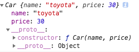
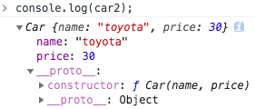

# 轮子们
------
今天来学习一下模拟实现下面几个函数：增加对基础知识的理解。在此要先谢谢网络上各位大神的文章，有时候书中难以得到直白的“答案”，别人的讲解会让你瞬间明白。

* new Constructor()
* call()
* apply()
* bind()

### mimic new 运算
自定义一个对象，通常做2件事：
1. 通过写一个函数定义一个对象类型；
2. 用new来创建一个实例。

例子：
```javascript
function Car(name, price){
    this.name = name;
    this.price = price;
}
let car = new Car("toyota",30);
console.log(car);
```


根据MDN上的解释，`new Car(...)`执行时，做了下面几件事：

1. 一个新对象被创建，并继承Car.prototype;
2. 执行了构造函数Car()一次，当然需要将this值绑定到新的对象。

另外：要是构造函数返回一个函数或者对象，则会覆盖正在创建的这个新对象，其他情况下会返回新对象。

```javascript
function mimicNew() {
    var obj = Object.create(Object.prototype);//创建一个对象
    var constructorFunc = [].shift.call(arguments);//返回传入的第一个参数，即是构造函数Car
    obj.__proto__ = constructorFunc.prototype;//将obj的__proto__指向Car的原型对象，即是继承
    var res = constructorFunc.apply(obj,arguments);//此时的arguments已经去掉了构造函数，剩余的参数可以直接传入Car()
    return res instanceof Object ? res : obj;
}
let car2 = mimicNew(Car,"toyota",30);
console.log(car2);
```


### mimic call()函数
函数如果通过call的方式调用，可以把this指向任意对象。
先看下面的例子：
```javascript
function showMessage(message) {
 console.log(message, this.name);
}
const obj1 = {name: "rui"};
const obj2 = {name: "xin"};
showMessage.call(obj1, "welcome ");//welcome rui
showMessage.call(obj2, "welcome ");//welcome xin
```
上面的call函数的效果等同于把showMessage函数添加到obj1中，再调用这个函数。
```javascript
let fn = Symbol("symbol");//创建一个Symbol()，作为showMessage在obj1中的属性名，这样可使其唯一。
const obj1 = {
    name:"rui",
    [fn]:function(message){console.log(message, this.name);}//showMessage
}
obj1[fn]("welcome");//welcome rui
```
====
尚未整理完毕
```javascript
//因为showMessage函数也是对象，当调用从函数原型继承下来的函数mimicCall时，
//mimicCall内部的this会指向调用它的showMessage，即是showMessage函数的引用。
//所以给someOtherThis的新属性添加这个showMessage函数。
//someOtherThis[fnName]();表示再执行它。

Function.prototype.mimicCall = function(someOtherThis) {
    let fnName = Symbol();
    someOtherThis[fnName] = this;
    
    const args = [];
      // arguments are saved in strings, using args
      for (var i = 1, len = arguments.length; i < len; i++) {
        args.push("arguments[" + i + "]");
      }
    console.log(args);
    // strings are reparsed into statements in the eval method
    // Here args automatically calls the Array.toString() method.
    var result = eval("someOtherThis[fnName](" + args + ")");
    delete someOtherThis[fnName];

    return result;
}

showMessage.mimicCall(obj1,"welcom2");

Function.prototype.mimicCallES6 = function(someOtherThis, ...args) {
    someOtherThis = someOtherThis || window;
    let fnName = Symbol();
    someOtherThis[fnName] = this;
    var result =  someOtherThis[fnName](...args);
    Reflect.deleteProperty(someOtherThis, fnName);
    return result;
}

showMessage.mimicCallES6(obj1,"mimic");


Function.prototype.mimicApply = function (someOtherThis, arr) {
    someOtherThis = someOtherThis || window;
    let fnName = Symbol();
    someOtherThis[fnName] = this;

    var args = [];
    var result = null;
    if (!arr) {
        result = someOtherThis[fnName]();
    } else {
        for (let i = 0, len = arr.length; i < len; i++) {
          args.push("arr[" + i + "]");
        }
        result = eval("someOtherThis[fnName](" + args + ")");
    }

    delete someOtherThis[fnName];
  
    return result;
}

showMessage.mimicApply(obj1,["mimic"]);

Function.prototype.mimicApplyES6 = function (someOtherThis, arr) {
    someOtherThis = someOtherThis || window;
    let fnName = Symbol();
    someOtherThis[fnName] = this;

    var args = [];
    var result =  someOtherThis[fnName](...arr);
    
    Reflect.deleteProperty(someOtherThis, fnName);
  
    return result;
}
showMessage.mimicApplyES6(obj1,["mimic"]);

//-----------------------------------------------------

Function.prototype.mimicBind = function(newThis) {

  if (typeof this !== "function") {
    throw new Error(this + "cannot be bound as it's not callable");
  }

  var boundTargetFunction = this;
  var boundArguments = Array.prototype.slice.call(arguments, 1);

  return function boundFunction() {
    // here the arguments refer to the second time when we call the target function returned from bind
    var targetArguments = Array.prototype.slice.call(arguments);

    return boundTargetFunction.apply(newThis,boundArguments.concat(targetArguments));
  };
};

showMessage.mimicBind(obj1,"mimic")();
```
