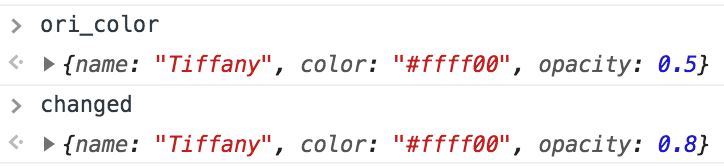
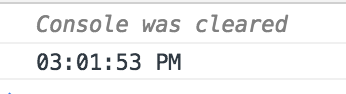

# 概念
------
#### 1.函数式编程
* 就是把变量干的事情让函数去干，编写大量小型函数，通常使用箭头函数，这是一种代码风格
* 广义上讲是声明式编程的一部分，声明式编程喜欢将具体实现隐藏到每个小型函数中，通过读取函数本身就可以知道函数的意图，注重结果而非过程。
* 函数式编程还有下面几点核心概念：
    - `不可变性`：即是不修改原生数据前提下，在数据的拷贝上进行操作，并返回这些拷贝。
    - `使用纯函数`： 至少接收1个参数，且函数总是返回一个值或函数。纯函数不会修改全局变量，不会产生任何副作用。
    - `使用高阶函数`：即是操作函数的函数，常见2种情况：（1）参数是函数，例如：Array.reduce(),Array.map(),Array.filter()等都是。（2）返回值是函数：`return function(){...}`
    - 柯里化：就是采用了高阶函数的一种编程技巧：它将某个操作中完成的结果保留，直到剩余部分都完成并一起返回结果。
    - `递归`：就是函数自己调用自己，它可以作为循环的一种替代。
    - `合成`：因为函数式编程通常会将业务逻辑拆分成若干个小型纯函数，最后需要将这些小型函数整合在一起，通过串联或并联的方式进行调用。合成的手段有很多，常见的是链式调用。合成的目标就是“通过整合若干简单的函数构造一个更高阶的函数”

##### 1.1 举例
>数据的不可变性

```javascript
let ori_color = {name:"Tiffany",color:"#ffff00",opacity:0.5}
const changeColor = (color, opacity) => ({
    ...color,
    opacity
});
let changed = changeColor(ori_color,0.8);
changed.opacity;//0.8
```
changeColor 函数保证了外界数据ori_color的不可变性，函数通过ES6的`{...color,opacity}`扩展运算符将原对象与新属性合并成一个新的对象并返回，因为ori_color中的opacity属性会被后传入的opacity属性覆盖，所以达到修改数据的目的。



>纯函数

```javascript
let ages = [27,30,32,40,81,29];
const getOldest = (arr) => arr.reduce((oldest,v) => oldest > v ? oldest : v);
let oldest = getOldest(ages);//81
```
getOldest函数就是一个纯函数，它接收一个arr数组参数，返回数组的最大值，对ages没任何影响。

>高阶函数

```javascript
const invokeIf = (condition, fnTrue, fnFalse) => (condition) ? fnTrue() : fnFalse();
const messageSuccess = () => console.log("success");
const messageFaile = () => console.log("fail");

invokeIf(true,messageSuccess,messageFaile);//success
invokeIf(false,messageSuccess,messageFaile);//fail
```
invokeIf函数就是一个高阶函数

```javascript
const sum = (a) => (b) => a+b;
sum(2)(3);//5

const logs = user => message => console.log(`${user}---${message}`);
logs("rui")("login");//rui---login
```
上面的sum和logs就是通过在一个函数里返回另外一个函数实现了柯里化。

>递归

```javascript
const countdown = (value, fn, delay=1000) => {
    fn(value);
    return (value > 0) ? setTimeout(() =>  countdown(value - 1, fn),delay) : value
    } 
const log = value => console.log(value);
countdown(10,log);
```
实现一个“倒计时”功能，向countdown传入10秒，以及显示log的log函数。并每等待1秒再调自己，这样以来就创建了一个倒计时时钟。

>合并

```javascript
const compose = (...fns) => (arg) => fns.reduce((compose, f)=> f(compose), arg);
const f1 = (a) => a+1;
const f2 = (b) => b+1;
compose(f1,f2)(10);//(10+1)+1 = 12
```
第一个函数的输出是第二个函数的输入，第二个函数的输出是第三个函数的输入.... 并且我们通过传入第一个函数的参数开始在“数据传递管道”中执行。

##### 1.2 综合应用
```javascript
const compose = (...fns) => (arg) => fns.reduce((compose, f)=> f(compose), arg);
const oneSecond = () => 1000;//1s
const getCurrentTime = () => new Date();//获取当前时间
const clear = () => console.clear();//清除显示
const log = message => console.log(message);//打印message

const serializeClockTime = date => ({ //返回一个新对象，包含日期的时分秒
    hours:date.getHours(),
    minutes:date.getMinutes(),
    seconds:date.getSeconds()
});

const civilianHours = clockTime => ({//把24小时显示转换为12小时制显示
    ...clockTime,
    hours: (clockTime.hours > 12) ? clockTime.hours - 12 : clockTime.hours
});

const appendAMPM = clockTime => ({// 根据小时添加一个ampm字段，存显示PM还是AM
    ...clockTime,
    ampm: (clockTime.hours >= 12) ? "PM" : "AM" 
});

const display = target => time => target(time);

const formatClock = format => time => format.replace("hh",time.hours).replace("mm",time.minutes).replace("ss",time.seconds).replace("tt",time.ampm);

const prependZero = key => clockTime => ({
    ...clockTime,
    [key]:(clockTime[key] < 10) ? "0" + clockTime[key] : clockTime[key]
});

const convertToCivilianTime = clockTime => compose(appendAMPM,civilianHours)(clockTime);

const doubleDigits = civilianTime => compose(prependZero("hours"),prependZero("minutes"),prependZero("seconds"))(civilianTime);

const startTicking = () => setInterval(
        compose(
            clear,
            getCurrentTime,
            serializeClockTime,
            convertToCivilianTime,
            doubleDigits,
            formatClock("hh:mm:ss tt"),
            display(log)
            ),
            oneSecond()
    );

startTicking();
```


[返回顶端](#概念)  [返回目录](../README.md)
