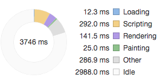

# 杂记
------

记录每天看到的js问题。

##### 防抖与节流

* 防抖：多次触发事件（如：用户点击按钮提交表单数据）后，事件处理函数只执行一次，并且是在触发操作结束时执行
* 原理：对处理函数进行延时操作，若设定的延时到来之前，再次触发事件，则清除上一次的延时操作定时器，重新定时。

* 节流：多次触发事件（如：用户滑动长列表时），按均匀时间间隔触发事件处理函数
* 原理：对处理函数进行延时操作，按照固定时间间隔来触发处理函数。

```javascript
var movecount = 0;//处理函数触发次数
var scrollcount = 0;//处理函数触发次数

function  userMouseMove(e) {
    console.log(++movecount);
};

function  userScroll(e) {
    console.log(++scrollcount);
};

function debounce(func, wait) {//防抖
    var timeout;

    return function () {
        var context = this;
        var args = arguments;

        clearTimeout(timeout); //只要事件进来，先清除上一轮计时

        timeout = setTimeout(function(){
            func.apply(context, args);
        }, wait);//重新开始计时，延迟wait后执行处理函数
    }
}

function throttle(func, wait) {//节流
    var timeout;
    var previous = 0;

    return function() {
        context = this;
        args = arguments;
        if (!timeout) {//判断上一轮timer是否完成，若已完成，才开启新的timer
            timeout = setTimeout(function(){
                timeout = null;
                func.apply(context, args);
            }, wait)//固定wait时间段内执行一次处理函数
        }
    }
}

var debounceBox = document.getElementById('debounceBox');
debounceBox.addEventListener('mousemove', debounce(userMouseMove, 1000));

var throttleBox = document.getElementById('throttleBox');
throttleBox.addEventListener('scroll', throttle(userScroll, 1000));
```
[完整demo](./code/deth.html)

##### 回流/重排(reflow)与重绘(repaint)

* flow:生成布局
* paint:绘制
* flow+paint = render(渲染)
* 网页生成的时候，至少会渲染一次。用户访问的过程中，会不断重新渲染，例如改变DOM，改变样式，用户事件（缩放屏幕等）。
* 重新渲染=重排（layout改变，DOM结构发生变化，例如改变一个元素的位置）+重绘（重新绘制，若只改变元素样式，例如颜色，不会重排，只会重绘。）但重排后必然重绘，因为layout布局变了所以要重新绘制。
* 网页是如何生成的？
    * HTML代码解析转化为DOM Tree。
    * CSS 代码解析转化为CSS Object Model
    * 将DOM Tree 和 CSSOM 合成一个渲染树（包含了节点信息和样式）
    * 生成布局（layout）
    * 绘制到屏幕
* 重排和重绘会不断触发不可避免。它们非常耗费资源，是导致网页性能低下的根本原因。
* 提升页面性能的方法（降低浏览器重新渲染的频率和成本）：
    
```javascript
div.style.color = 'red';//重绘
var margin = parseInt(div.style.marginTop); 
div.style.marginTop = (margin + 10) + 'px';//重排+重绘
```

* 避免一条条地改变样式，通过改变class一次性修改，若要一条条修改，读和写操作分开，不要混合一起。
* 使用Document Fragment对象创建DOM，创建好后再加入真实DOM，例子可见：
* [如何渲染几万条数据不卡住页面？](./README.md#### 3.如何渲染几万条数据不卡住页面？)
* 先将元素设为display: none（需要1次重排和重绘），然后对这个节点进行100次操作，最后再恢复显示（需要1次重排和重绘）。这样一来，你就用两次重新渲染，取代了可能高达100次的重新渲染。
* position属性为absolute或fixed的元素，重排的开销会比较小，因为不用考虑它对其他元素的影响。
* 只在必要的时候，才将元素的display属性为可见，因为不可见的元素不影响重排和重绘。另外，visibility : hidden的元素只对重绘有影响，不影响重排。
* 使用虚拟DOM的脚本库，比如React等。
* 使用 window.requestAnimationFrame()、window.requestIdleCallback()：这两个方法调节重新渲染。
    * window.requestIdleCallback(fn)会在浏览器空闲时期依次调用函数
    * window.requestAnimationFrame(fn)将某些代码放到下一次重新渲染时执行

* 显示器的刷新频率是60帧，若是网页动画也做到一秒之内进行60次重新渲染，每次重新渲染的时间不能超过16.66毫秒，那人眼看上去就非常流畅，若是低于30帧就会感到卡顿。
* 刷新率就是指（Frame per second）一秒之内可以重新渲染的次数，60FPS就是指1秒钟渲染60次，意味着js代码每次执行任务耗时不超过16毫秒。
* Web Worker，主线程只用于UI渲染，然后跟UI渲染不相干的任务，都放在Worker线程。

* 在Chrome浏览器开发者模式下通过`Performence`工具可以分析网页的性能。



##### Web Worker

* web worker是H5的概念，它可以让一些事情在“Worker线程”执行，而不影响主线程（通常负责UI）。
* 主线程与子线程脚步(worker.js)需要在同源下访问。
* 主线程可以创建/监听/postMessage/关闭 worker线程
* 子线程也可以监听主线程的消息，向主线程发消息，关闭自己

```javascript
//worker.js 子线程
this.addEventListener('message', function (e) {//监听主线程发来的消息
  this.postMessage('向主线程发消息: 你刚刚发来的内容是：' + e.data.name + e.data.args);//向主线程回话
  timedCount();
}, false);

var i=0;

function timedCount(){
    i=i+1;
    postMessage(i);//向主线程发消息
    setTimeout("timedCount()",500);
}
```

```javascript
var worker = new Worker('worker.js');//创建子线程
worker.postMessage({name: '我是主线程', args: "hi"});//发消息给子线程

worker.addEventListener('message',function (event) {//监听子线程发来的消息
  console.log('Received worker message ' + event.data);
  document.getElementById("res").innerHTML = event.data;
});

worker.addEventListener('error', function (event) {//监听错误消息
  console.log(event);
});
```
[完整demo](./code/webworker/)

[返回顶端](#杂记) [返回目录](../README.md)
