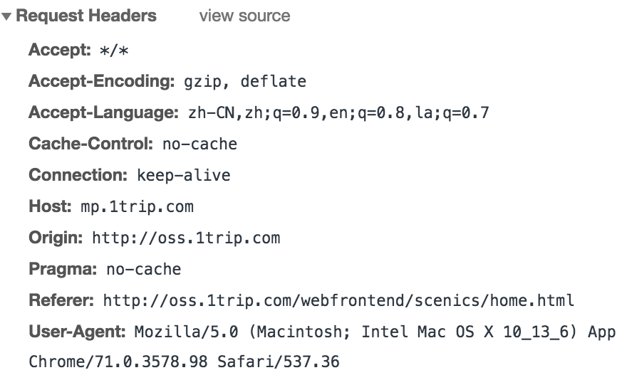
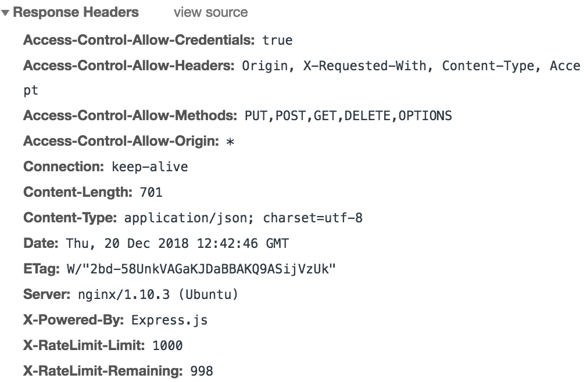

# 杂记
------

##### 浏览器中输入一个URL发生了哪些过程？一个URL包含哪些部分

* URL（Uniform Resource Locator）:统一资源定位符，用于定位互联网上的资源，俗称网址。
* 包含：协议://主机:端口号/路径?参数
* 例如：http://liruii.com/index.html 默认80端口号

>URL

* 传输协议：常见的有：http(超文本传输协议)， https（http+TLS/SSL）， ftp（File Transfer Protocol，文件传输协议） 
* 域名：由一串用点分隔的名字组成的Internet上某一台计算机或计算机组的名称
* 主机IP地址唯一，为方便用户记住，通过DNS服务系统让域名和IP地址做映射

>简单的看待浏览器输入一个URL发生了什么

* 一、DNS解析：DNS(Domain Name System)域名解析服务器将域名解析成对应的IP地址
* 二、TCP 连接：TCP 三次握手 
    * 第一次握手：浏览器->服务器（客户端：我要发消息给你了哦）：客户端发送一个带 SYN=1，Seq=X 的数据包到服务器端口
    * 第二次握手：服务器->浏览器（服务端：好的我晓得了）：服务器发回一个带 SYN=1， ACK=X+1， Seq=Y 的响应包以示传达确认信息
    * 第三次握手：浏览器->服务器（客户端：好，我马上发，你准备接）：客户端再回传一个带 ACK=Y+1， Seq=Z 的数据包，代表“握手结束”
* 三、发送 HTTP 请求
    * HTTP 请求报文由三部分组成：
        * 请求行：请求方法(GET,POST,PUT,DELETE,PATCH,HEAD,OPTIONS,TRACE)、URL(<协议>：//<主机>：<端口>/<路径>?<参数>)、协议版本(如：HTTP/1.1) 组成
        * 请求头HTTP Request Header：key:value形式 常见的：`accept: text/javascript, application/javascript` `cache-control: no-cache` 等
        * 请求体：请求的数据
        
        

* 四、服务器处理请求并返回 HTTP 报文
    * web服务器(常见的：apache、nginx、IIS)可以解析HTTP请求，并返回一个HTTP响应
    * web服务器通常把响应的生产委托给服务器端(server-side)脚本（例如：JSP，ASP，Javascript），这些服务器端(server-side)程序会负责事务处理、数据库连接等，最后产生HTTP response。
    * http 响应报文由三部分组成：
        * 响应行：协议版本，状态码（200 OK|301 资源被移到新位置|304 缓存|403 被拒绝|404 没找到|500 服务器内部错误），状态码描述
        * 响应头HTTP Response Header：key:value形式 常见的：`Access-Control-Allow-Origin: *` `Content-Type: application/json; charset=utf-8` `Content-Length: 701`
        * 响应体：返回的数据
        
        

* 五、浏览器解析渲染页面
    * 根据HTML代码解析转化为DOM Tree
    * 根据CSS 代码解析转化为CSS Object Model规则树
    * 将DOM Tree 和 CSSOM 合成一个渲染树（包含了节点信息和样式）
    * 根据渲染树生成布局（layout）
    * 绘制到屏幕
* 六、断开连接：TCP 四次挥手
    * 第一次挥手：由浏览器发起的，发送给服务器，我请求报文发送完了，你准备关闭吧
    * 第二次挥手：由服务器发起的，告诉浏览器，我晓得了，我也快完了，你也准备吧
    * 第三次挥手：由服务器发起，告诉浏览器，我响应报文发送完了，你关闭吧
    * 第四次挥手：由浏览器发起，告诉服务器，我响应报文接受完了，我关了，你也关吧

[返回顶端](#杂记) [返回目录](../README.md)