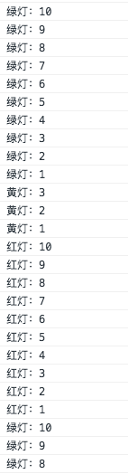

# 杂记
------
学习js中遇见的 ***趣事***

#### 1.sum(2,3)实现sum(2)(3)

```javascript
let sum = (a) => (b) => a+b;
sum(2)(3);//2+3= 5

//那sum(2)(3)(5)?
let sum = (a) => (b) => (c) => a+b+c;
sum(2)(3)(5);//10

//那sum(2)(3)(5)......?
//思考
let sum = (a,b)=>a+b;
let newsum = sum.bind(null,2);
newsum(3);

[2,3,5].reduce((s,v,i,arr) => {return s+v});//10
```

#### 2.同事问：如何实现红绿灯？
方法很多种，我只把我最初想到的最简单的思路写下来。

```javascript
let timer;
let light = (start,g,y,r) => {
    let count = 0;
    if(start){
        timer = setInterval(()=>{
            if(count < g){
                console.log("绿灯：" + (g-count));
            } else if(count >= g && count < (g+y)){
                console.log("黄灯："+(g+y-count));
            } else if(count >= (g+y) && count < (g+y+r)){
                console.log("红灯："+(g+y+r-count));
            } else {
                count = 0;
                console.log("绿灯：" + g);
            }
            count++;
        },1000);
    } else {
        clearInterval(timer);
        timer = null;
        count = 0;
    }
};

light(true,10,3,10);//启动，设置10秒绿灯，3秒黄灯，10秒红灯，如此循环
light(false,0,0,0);//关闭，剩余参数可以设为0
//思考：如何优化？
```


