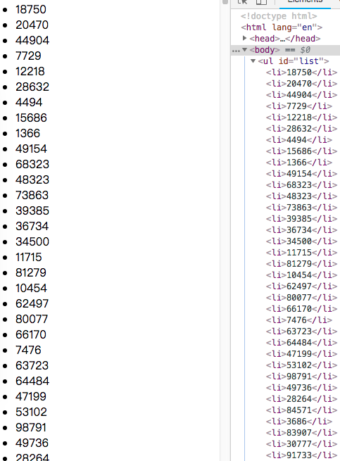
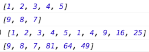

# 杂记
------
js中遇见的 ***趣事***

#### 1.sum(2,3)实现sum(2)(3)

```javascript
let sum = (a) => (b) => a+b;
sum(2)(3);//2+3= 5

//那sum(2)(3)(5)?
let sum = (a) => (b) => (c) => a+b+c;
sum(2)(3)(5);//10

//那sum(2)(3)(5)......?
//思考
let sum = (a,b)=>a+b;
let newsum = sum.bind(null,2);
newsum(3);

[2,3,5].reduce((s,v,i,arr) => {return s+v});//10
```

#### 2.同事问：如何实现红绿灯？
方法很多种，我只把我最初想到的最简单的思路写下来。

```javascript
let timer;
let light = (start,g,y,r) => {
    let count = 0;
    if(start){
        timer = setInterval(()=>{
            if(count < g){
                console.log("绿灯：" + (g-count));
            } else if(count >= g && count < (g+y)){
                console.log("黄灯："+(g+y-count));
            } else if(count >= (g+y) && count < (g+y+r)){
                console.log("红灯："+(g+y+r-count));
            } else {
                count = 0;
                console.log("绿灯：" + g);
            }
            count++;
        },1000);
    } else {
        clearInterval(timer);
        timer = null;
        count = 0;
    }
};

light(true,10,3,10);//启动，设置10秒绿灯，3秒黄灯，10秒红灯，如此循环
light(false,0,0,0);//关闭，剩余参数可以设为0
//思考：如何优化？
```


#### 3.如何渲染几万条数据不卡住页面？
看到这个问题的第一反应是：实际的产品设计中应该不会这种需求吧，首先几万条数据应该不是一次性请求回来的，肯定需要分批请求，或根据用户的操作加载更多数据。就算现在有几万条数据需要渲染出来，ios中会复用cell，其实超过一屏幕的cell就不会渲染了。那在网页中，肯定也是分批渲染的。

```html
<ul id="list"></ul>
```

```javascript
const total = 100000;//总数10万条
const once = 20;//单次插入20条
const loopCount = total / once; //需要渲染几次
let countOfRender = 0;

let list = document.querySelector("#list"); 

function addLi() {
  const fragment = document.createDocumentFragment(); //创建一个文档片段，通过将子元素li插入片段时，不会造成回流/重排

  for (let i = 0; i < once; i++) {
   const li = document.createElement("li");
   li.textContent = Math.floor(Math.random() * total);
   fragment.appendChild(li);
  }

  list.appendChild(fragment);//将带20条li的片段插入到ul中
  countOfRender += 1;
  loop();
}
 
function loop() {
  if (countOfRender < loopCount) {//只要没达到总共需要渲染的次数，就不断重绘
    window.requestAnimationFrame(addLi);//刷新屏幕，add函数在下次重新渲染时执行。
  }
} 

loop();
```



#### 4.页面上有一个input，还有一个p标签，改变input后p标签也跟着变化，如何处理？
乍一看，很简单呢，做个监听就好啦
```javascript
//html
<p id="num"></p>
<input type="text" name="num" id="numinput"/>

//js
var input = document.querySelector('#numinput');
var numtext = document.querySelector('#num');
input.addEventListener('input',function(event){
  numtext.innerText = event.target.value;
},false);//监听input值变化，有输入即触发

input.addEventListener('change',function(event){
  numtext.innerText = event.target.value;
},false);//监听input值变化，只有失去焦点时才触发

```

上面的方法就是最基本的实现input输入变化时p标签的值也跟着变化。再思考一下，input和p标签是不是捆绑得太紧了？我们来适当“松绑”一下：

```javascript
var data = {//数据对象
  num:0 
};

(function(){
  var self = this;
  function watch(obj,prop,callback){//监听函数
    let val = obj[prop];
    Object.defineProperty(obj,prop,{
      get: function(){
        return val;
      },
      set: function(newVal){
        val = newVal;
        callback(val);
      }
    });
  }
  self.watch = watch;
})();
```
我们重新创建了一个数据对象`data`,它有一个属性`num`，让它作为“中间人”来松绑input与p标签，不论是input的输入变化还是p标签的显示都只与中间人有关系，当input发生变化时，我们只去修改`num`的值，而p标签的值就是`num`的值，当`num`改变时，p标签也自动显示变化后的值了。那么需要一个`watch`功能的函数来监听`num`的变化，利用`Object.defineProperty`添加get和set，并在set时返回callback函数。

```javascript
watch(data,"num",function(v) {//监听num变化，在值变化时改变p标签的值，从此与input无关系
  numtext.innerText = v;
});
input.addEventListener('input',function(event){//input变化时只改变num的值，与p标签也无关系
  data.num = event.target.value;
},false);

input.addEventListener('change',function(event){
  data.num = event.target.value;
},false);

```

#### 5. JavaScript基础问题：

##### 5-1. 是下面代码运行正常：

```javascript
const a = [1, 2, 3, 4, 5];
a.multiply();
console.log(a);//[1,2,3,4,5,1,4,9,16,25]
```

咋看一眼需要打印的结果，是处理数组每个元素自乘后追加到数组中。再看是运行`a.multiply()`，及实现这个方法。a 是数组类型Array，我们在它的原型上添加multiply方法，让所有数组实例都可以访问。

```javascript
const a = [1, 2, 3, 4, 5];
const b = [9, 8, 7];
Array.prototype.multiply = function(){
  this.map((v)=>this.push(v*v));
};
console.log(a);
console.log(b);
```


##### 5-2. `0.1 + 0.2 === 0.3` 为什么返回false

答案是：`0.30000000000000004`，所以返回false。
JavaScript中的表示数字类型的只有Number类型，它是采用IEEE 754标准定义的64位双精度浮点格式表示数字，所以JS中的所有数字都是浮点数，没有区分整数与浮点数。深层次原因可以参考[http://0.30000000000000004.com/]

`parseFloat((0.1 + 0.2).toFixed(10))` 可以解决，更多的坑可以使用[http://mathjs.org/]提供的库来操作运算。

##### 5-3. Proxy实现简单的数据绑定

和使用Object.defineProperty()来监听set/get是类似的。

```javascript
let target = {name:"rui"};//创建目标对象
let proxy = new Proxy(target,{ //生成一个代理
    set(trapTarget, key, value, receiver){//set陷阱 接受4个参数

        if(!trapTarget.hasOwnProperty(key)){//拦截进行自定义操作，这里是判断新增属性值是否为数字
            if(isNaN(value)){
                throw new TypeError("新添加属性值必须为数字");
            }
        }
        return Reflect.set(trapTarget, key, value, receiver);//调用反射API：Reflect.set()进行内建操作
    },
    get(trapTarget,key,receiver){//get陷阱 接受3个参数

        if(!(key in receiver)){//自定义操作判定key是否存在
            throw new TypeError(`${key}不存在`);
        }
        return Reflect.get(trapTarget, key, receiver);//调用反射API：Reflect.get()进行内建操作
    }
});
```
先回顾一下Proxy，代理，可以拦截并改变底层js引擎操作的包装器。上面的代理拦截了obj的set/get操作，添加了自定义条件判断。

```javascript
proxy.count = 100;
target.count;//100;
proxy.age = "18";//抛出异常
proxy.name;//rui
```
简单的数据绑定则就是使用代理基本操作set/get

```javascript
const onWatch = (target, setCb, getCb) => {
      const handler = {
          set(trapTarget, key, value, receiver){
              setCb(value);
              return Reflect.set(trapTarget, key, value, receiver);
          },
          get(trapTarget,key,receiver){
              getCb(trapTarget,key);
              return Reflect.get(trapTarget, key, receiver);
          }
      };
      return new Proxy(target,handler);
};
let obj = {};
let value;
let proxy = onWatch(obj,(v)=>{
    value = v;
},(target,key)=>{
    console.log(`target[${key}] = ${target[key]}`);
});
proxy.name = "rui";
value;//rui 
obj.name;//rui
proxy.name;//target[name] =rui
```

##### 5-4. 若干基础

```javascript
//输出结果是什么
(function(){
  var a = b = 5; //js表达式从右到左执行，b=5,b没有var修饰，所以是全局变量，a有var修饰，是局部（私有）变量。
})();
console.log(a);// a is not defined 立即执行函数外，无法访问私有变量，所以a是is not defined，浏览器会报错
console.log(b);// 5  b是全局变量，可以在函数体外访问，是5

//用console.log自定义实现log(){} 打印“(MYLOG)hi”
function log(){
  return console.log.apply(this,["(MYLOG)" + [...arguments].join(" ")]);
}

log('hi');//(MYLOG)hi

//自定义实现trim()函数
//正则表达式字面量表示方式 ：// 
//^表示从此处开始匹配，\s 表示空白符，：空格 制表符、换页符等 $ 匹配输入字符串的结尾位置
//（）标记一个子表达式的开始和结束位置 + 表示匹配前面子表达式1次或多次 * 表示匹配前面子表达式0次或多次 g 表示全局搜索
//将以空格开头或结尾的字符替换成""
function Trim(str){
  return str.replace(/(^\s+)|(\s+$)/g, "");//(^\s*)|(\s*$)
}
//取掉字符串中所有空格
function RemoveAllEmpty(){
  return str.replace(/\s+/g, "");
}
console.log(Trim("   a  a "));
console.log(RemoveAllEmpty("   a  a "));

//js 反转一个二叉树
// 节点表示为
function TreeNode(val){
  this.val = val;
  this.left = null;
  this.right = null;
}

var myReserve = function (root){
  if(root !== null){
    var temp = root.left;
    root.left = root.right;
    root.right = temp;
    myReserve(root.left);
    myReserve(root.right);
  }
  return root;
}

//js 实现斐波那契数列函数
//斐波那契数列： 1，1，2，3，5，8，13，21，34.... （前2位之和等于后面一位的值，n从第3位起）
//f(1)=1 f(2)=1 f(3)=1+1=f(2)+f(1) f(4)=f(3)+f(2) f(n)=f(n-1)+f(n-2)
function fib(n){
  if(n === 1 || n === 2){
    return 1;
  } else{
    return fib(n-1)+fib(n-2);
  }
}

//尾调优化
function fib(n,n1=1,n2=1){
  if(n === 1 || n === 2){
    return 1;
  } else{
   //???
    return fib(n-1,n2,res);
  }
}
```
##### 5-5. ES6的尾调用优化

* 尾调用：指函数作为另一个函数的最后一句语句被调用。
* 在引擎中，尾调用的函数和其他函数调用类似，创建一个新的栈帧，将其推入调用栈来表示函数调用。
* 当在循环调用中，每一个未完成的栈帧都会被保存在内存中，当循环次数过大，调用栈会变得过大从而造成内存占据过大问题。
* ES6中，满足下面条件，尾调用将不再创建新的栈帧，而是清除并重用当前栈帧。

```javascript
"use strict"//条件1:严格模式下
function doSomething(){
  //条件2:尾调用不访问当前栈帧的变量（即尾调用函数不是一个闭包）
  return doSomethingElse();//条件3/4:尾调用结果作为返回值，有return 尾调用是最后一条语句
}
```
* 你除非考虑优化函数，通常情况下无需思考此类问题：递归是主要应用场景。
```javascript
//常见递归：求阶乘factorial
function factorial(n){
  if(n <= 1){
    return n;
  } else {
    return n * factorial(n-1);//无法尾调优化
  }
}
factorial(5);//120

//改写：
"use strict"
function factorial2(n,p=1){
  if(n <= 1){
    return 1*p;
  } else {
    let res = n*p;//保存乘法结果，下一次迭代时直接用它计算，不再需要额外的函数调用
    return factorial2(n-1,res);//尾调优化
  }
}
factorial2(5);//120
```
任何被递归定义的函数都可以改写为迭代。

[返回顶端](#杂记) [返回目录](../README.md)