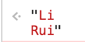

# ES6
------

##### 1. TDZ(临时死区)

* js引擎在扫描代码发现变量声明时，`var`声明：提升至作用域顶部； `let | const`声明：放入TDZ中，访问TDZ中的变量会触发运行时错误(typeof value)，当执行过变量声明语句后，变量从TDZ移除，正常访问。
* `let | const` 在全局作用域中不会覆盖全局变量，只会`遮蔽`。
* 在`for循环` 中，let每次迭代都会创建新绑定，并将其值初始化为i的当前值，相当于一个i的副本。

##### 2. 模版字面量

* 反撇号+占位符 \` name is ${name} \` 
* 标签模版 

```javascript
function raw(l,...subs){
    let res = "";
    for(let i = 0; i < subs.length; i++){
        res += l.raw[i];
        res += subs[i];
    }
    res += l.raw[l.length - 1];
    return res;
}
let m1 = `Li\nRui`;
let m2 = String.raw`Li\nRui`;
let m3 = raw`Li\nRui`;
console.log(m1);//输出换行的字符串
console.log(m2);//输出转义之前的原生字符串
console.log(m3);//输出转义之前的原生字符串，与String.raw()标签一致
```




##### 3. 扩展运算符(...)

```javascript
let values = [2,39,80,1];
Math.max.apply(Math,values);
Math.max(...values);
```

##### 4. 函数

* 可以定义默认参数 `function a(arg="123")`。
* 可以定义不定参数 `function add(...args)`。
* 可以通过`if(typeof new.target !== "undefined")` 判断函数通过哪种方式调用。
* ES6添加了箭头函数`const add = (a,b) => a+b;`
* 尾调用优化使函数保持一个小的调用栈，减少内存使用，避免栈溢出。

##### 5. 对象

* 简化属性定义方法`let obj = {name,age,sayHi(){...}}`
* 增加可计算属性名`[xxx]`
* `Object.is(a,b)` 代替 `===` 弥补全等运算的不准确性。`Object.is(+0,-0);//false`
`Object.is(NaN, NaN);//true`
* `Object.assign({},{},...)`

```javascript
function mixin(receiver, sup){//浅复制
    Object.keys(sup).forEach((key)=>{
        receiver[key] = sup[key];
    });
    return receiver;
}
```
* 对象自有属性的枚举顺序： 1：数字（升序）2:字符串（加入对象的顺序）3:Symbol（加入对象的顺序）

##### 6. 解构

* 对象解构 `let {name, age} = person` 
* 数组解构 `let [, , last] = colors`;

##### 7. Symbol & Symbol.for()

```javascript
let s = Symbol('s1');
let obj = {[s] :"ruirui"};
console.log(obj[s]);//"ruirui"

//全局共享
let uid = Symbol.for("uid");
let obj1 = {[uid]:"123"};
console.log(obj1[uid]);//"123"
let uid2 = Symbol.for("uid");
uid === uid2;//true
```

##### 8. Map & WeakMap | Set & WeakSet

```javascript
let set = new Set();
set.add(4);
set.add(5);
set.has(4);//true
set.delete(5);
set.clear();

let map = new Map();
map.set("name", "ruirui");
map.set("age",18);
map.has("name");//true
map.get("name");//ruirui
```

* Set集合是包含多个非重复值的无序列表，值与值之间通过`Object.is()`来判断，若相同则自动过滤掉相同的值。
* WeakSet 只支持存放对象，weakSet内只剩引用时被垃圾回收器回收。
* Map集合是多个无序键值对组成的集合，键名支持任意数据类型。
* WeakMap 只支持对象为key，WeakMap内只有引用时，这个以对象为key的值会被垃圾回收。

```javascript
let obj1 = {key: value1};
let obj2 = {key: value2};
const set = new WeakSet();
set.add(obj1);
set.add(obj2);
obj1 = undefined;//set中的obj1也会remove
set.has(obj1);//false

const map = new WeakMap();
let o = {};
map.set(o,{key:"123"});
map.get(o);//{key:"123"}
o = undefined;//o 与 map中的o会在下一次垃圾回收时被清掉。
```

##### 9. 迭代器与生成器

* 迭代器：是一种特殊对象，它有`next()`方法，每次调用就返回一个结果对象`{value:"val",done:false}`
* 生成器：是一种返回迭代器的函数，通过`function *createIterator(){yield xxxx}`来创建

##### 10. 类

```javascript
class Person extends Object {
    constructor(name,age){//构造函数
        console.log(new.target);
        super();//有extends 时必须调用super来执行父类的构造函数
        this.name = name;//私有属性
        this.age = age;
    }
    //普通实例方法
    sayHi(){//相当于Person.prototype.sayHi = function(){}
        console.log(this.name);
    }
    //访问器属性
    set englishName(v){
        this._englishName = v;
    }

    get englishName(){
        return this._englishName;
    }
    //静态方法 
    static create(){
        return new Person("xx",0);
    }
}
let p = new Person('rr',18)
p.englishName = 'lynn'
Person.create()
```

* 类作为ES5传统继承模型的语法糖出现
* 类只能使用`new`来创建实例
* 类的所有方法都是不可枚举的


[返回顶端](#ES6) [返回目录](../README.md)