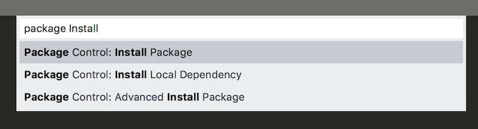
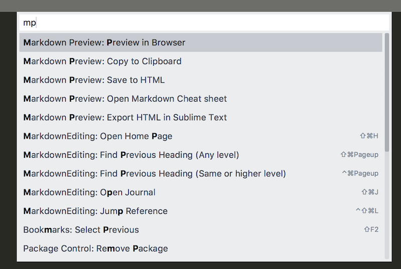
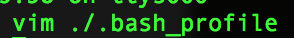
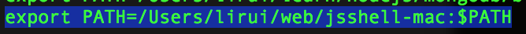
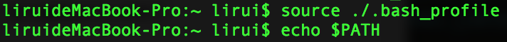
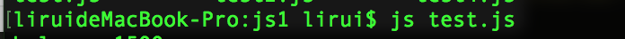

# 准备工作
------
### 学习环境准备

* Sublime Text 3 + Markdown 环境搭建
* Jsshell 环境搭建

### 学习参考书籍

* 《Javascript高级程序设计》（第3版）
* 《Javascript权威指南》
* 《深入理解ES6》
* 《数据结构与算法Javascript描述》

### 参考文章及网站

* [MDN](https://developer.mozilla.org/en-US/docs/Web/JavaScript)
* [javascript tutorial](http://www.javascripttutorial.net/)

------
#### 一、Sublime Text 3 + Markdown
>安装MarkdownEditing（用于.md文件编辑显示高亮）| 安装MarkdownPreview（用于.md文件预览）

    Sublime Text 3 -> Tools -> Command Palette(shift+command+p) -> Package Install 回车后 安装 MarkdownEditing 和 MarkdownPreview

>预览.md

	shift+command+p -> 输入mp -> 选择：Preview in Browser

#### 二、Jsshell 环境搭建
>jsshell用于快速执行js代码，对练习编码非常便捷。

1. 首先下载 [jsshell](https://archive.mozilla.org/pub/firefox/nightly/latest-mozilla-central/) 

2. 添加jsshell文件夹位置到用户级别环境变量:
	- vim ./.bash_profile
	
	
	
	- 添加export PATH=/Users/lirui/web/jsshell-mac:$PATH :wq保存文件
	
	
	
	- 执行source ./.bash_profile 查看环境变量echo $PATH
	
	

	- 进入js文件夹位置，打开终端 输入命令：js test.js 即可解释执行js文件了
	
	

[返回目录](../README.md)
